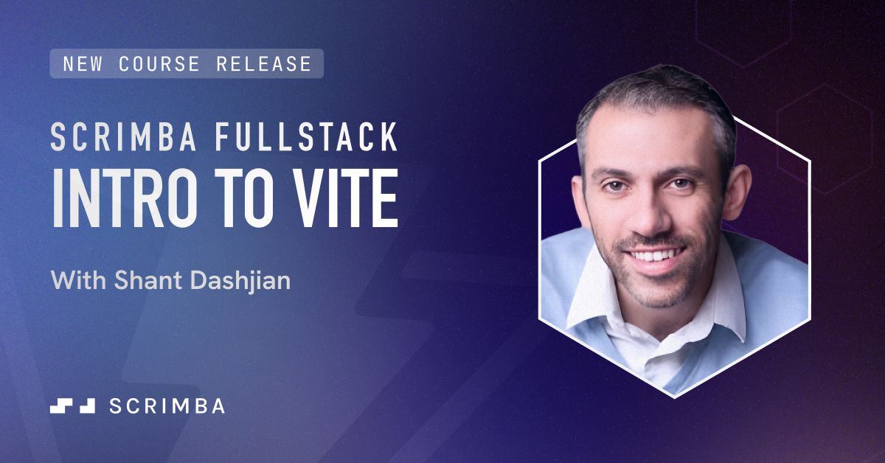
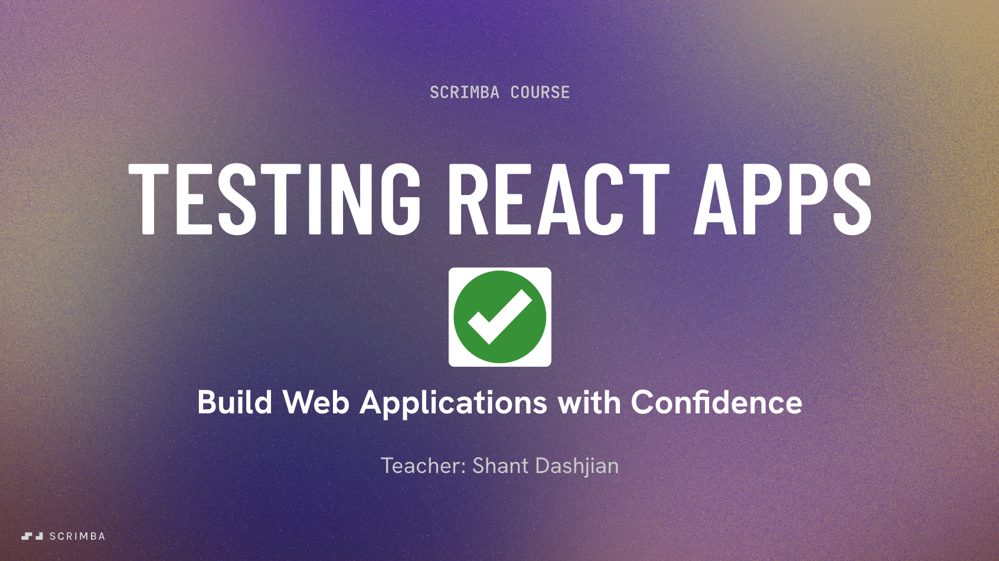
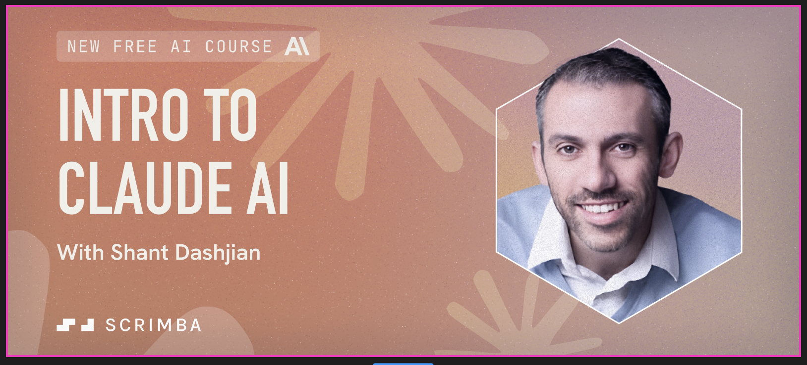

# 📚 My Courses
A collection of courses I built and published on [Scrimba](https://scrimba.com/home?coupon=SHANT50), where I teach various topics in web development and AI.

## ⚡ Motivation
I deeply enjoy programming and teaching. Since 2023, I taught at [Scrimba](https://scrimba.com/home?coupon=SHANT50), the popular web development learning platform. During this time, I taught various topics in web development and AI. This includes teaching how to build AI-powered applications with Claude AI, how to use build tools like Vite, and how to test React applications with Vitest, React Testing Library, and Mock Service Worker.

## 📝 The List
1. [Testing React Apps course](https://github.com/shantdashjian/testing-react-apps-course/)
2. [Intro to Vite course](https://github.com/shantdashjian/intro-to-vite-course/)
3. [Intro to Claude AI Course](https://github.com/shantdashjian/intro-to-claude-ai-course/)